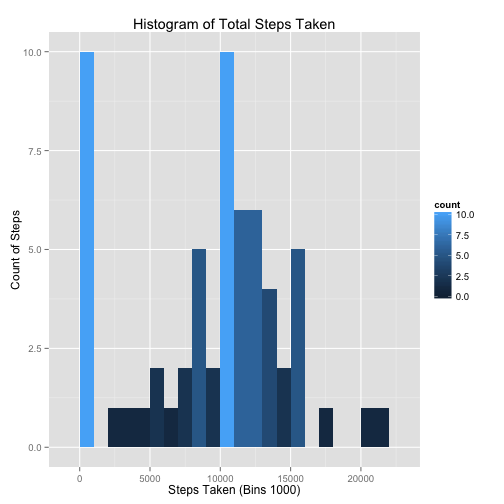
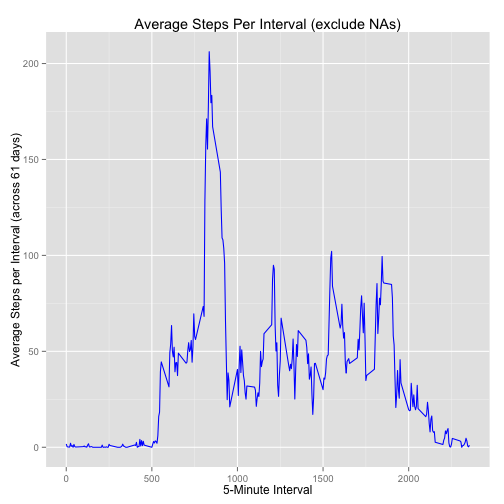
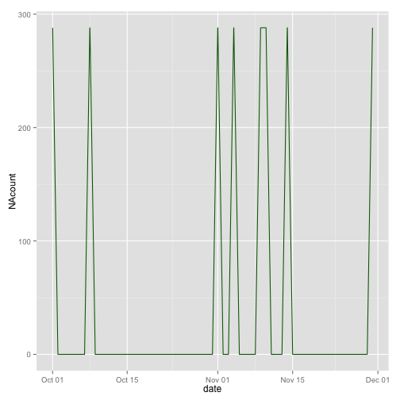
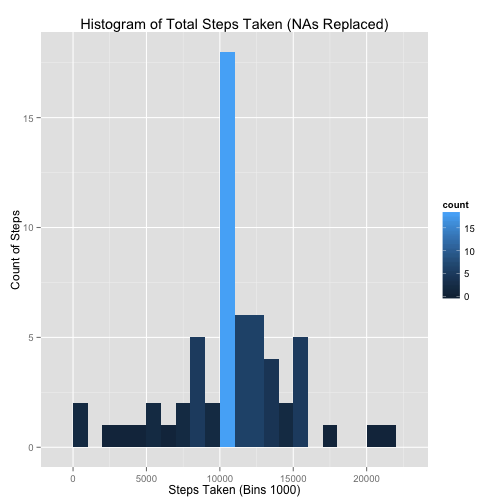
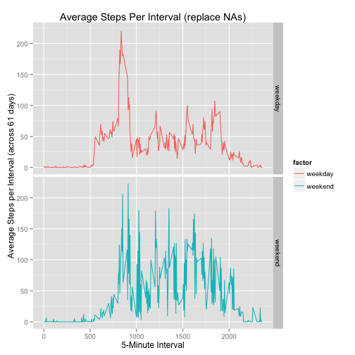

### Reproducible Research: Peer Assessment 1

## Assignment Overview
This assignment analyzes mean daily patterns using data from a personal activity monitoring device. The device collects data at 5- minute intervals throughout the day. The dataset consists of two months of data from an anonymous individual collected during the months of October and November, 2012 and includes the number of steps taken in 5 minute intervals each day.

Data was downloaded from the following address:
https://d396qusza40orc.cloudfront.net/repdata%2Fdata%2Factivity.zip

The variables included in this dataset are:  
- steps: Number of steps taking in a 5-minute interval (missing values are coded as NA)  
- date: The date on which the measurement was taken in YYYY-MM-DD format  
- interval: Identifier for the 5-minute interval in which measurement was taken  

There are a total of 17,568 observations in this dataset.

#### Load packages
To begin, we load the primary packages to be used during the session, ggplot2 and plyr.


```r
library(ggplot2)
library(plyr) 
```

#### Load the data

Our first step is to unzip and load the data into R. We transform the data variable into a POSIXlt date to facilitate the analysis.


```r
unzip("activity.zip")  # unzip the data file
data <- read.csv("activity.csv", stringsAsFactors=FALSE) # read the data into R
data$date <- strptime(data$date,"%Y-%m-%d") # convert date to POSIXlt
str(data) # print summary of the data
```

```
## 'data.frame':	17568 obs. of  3 variables:
##  $ steps   : int  NA NA NA NA NA NA NA NA NA NA ...
##  $ date    : POSIXlt, format: "2012-10-01" "2012-10-01" ...
##  $ interval: int  0 5 10 15 20 25 30 35 40 45 ...
```

#### Question 1: What is mean total number of steps taken per day?

*1.1 Histogram*

First, we develop a histogram of total steps taken per day. To do this, we first use the ddply function to calculate the total steps taken by day (excluding NAs). We then plot the histogram using this data.


```r
sums <- ddply(data,  # create new data table, sums, with total steps per day
      .(date),  # aggregate by date
      summarise,  # summarize the data
      sum_steps = sum(steps, na.rm = TRUE)) # sum steps to the aggration of date

hist <- ggplot(sums, aes(x=sum_steps)) +  # plot sum_steps
      geom_histogram(binwidth = 1000, # add histogram with bins of 1000
                     aes(fill = ..count..)) + # color by count
      labs(x = "Steps Taken (Bins 1000)",  # add labels
            y = "Count of Steps", 
            title = "Histogram of Total Steps Taken")

print(hist)
```

 

Interestingly, over 10 days have values from zero to 1,000 (the first bin.) We investigate these further, to find 8 days with zero steps per day.


```r
sums[sums$sum_steps<1000,]
```

```
##          date sum_steps
## 1  2012-10-01         0
## 2  2012-10-02       126
## 8  2012-10-08         0
## 32 2012-11-01         0
## 35 2012-11-04         0
## 40 2012-11-09         0
## 41 2012-11-10         0
## 45 2012-11-14         0
## 46 2012-11-15        41
## 61 2012-11-30         0
```

*1.2 Unadjusted Mean and Median*

We then calculate the unadjusted mean and median steps taken per day, store, and print the results. We use the sum_steps variable calculated previously.


```r
step_mean <- mean(sums$sum_steps) # take mean total steps per day
step_median <- median(sums$sum_steps) # take median of total steps per day

step_mean
```

```
## [1] 9354
```

```r
step_median
```

```
## [1] 10395
```

#### Question 2: What is the average daily activity pattern?

We now seek to identify the daily pattern (the average number of steps for each 5-minute period during the day.) 

*2.1 Time Series Plot*

We again use ddply to summarize the data set, this time to calculate the average number of steps for each interval independent of the day. We plot the data in a line graph to better understand the distribution.


```r
avgs <- ddply(data,  # use data
      .(interval),  # aggregate by interval (across days)
      summarise,  # summarize table
      avg_steps = mean(steps, na.rm = TRUE)) # calculate average steps

line <- ggplot(avgs, aes(x = interval, y = avg_steps)) +
      geom_line(colour="blue") +
      labs(x = "5-Minute Interval", 
            y = "Average Steps per Interval (across 61 days)", 
            title = "Average Steps Per Interval (exclude NAs)")

print(line)
```

 

*2.2 Peak Interval Time*  
Based on the histogram, it appears that peak movement occurs between the 500th and 1000th interval. We now calculate the interval with the largest average steps, which is the 835th interval, in which approximately 206 steps are taken on average across our days.


```r
max_steps <- max(avgs$avg_steps) # calculate highest average number of steps
max_interval <- avgs$interval[avgs$avg_steps == max_steps] # identify related interval

print(max_steps)
```

```
## [1] 206.2
```

```r
print(max_interval)
```

```
## [1] 835
```

This implies that the most active time (on average) across the 61-day sample set was from 1:55 pm to 2:00pm.


```r
max_interval/60  # max steps divided by 60 minutes in an hour is 13.916
```

```
## [1] 13.92
```

```r
max_interval - (13*60) # remaining minutes is 55
```

```
## [1] 55
```


#### Question 3: How to address the missing values?

*3.1 Missing Values*  
There are approximately 2,304 NA values in the data set.


```r
sum(is.na(data$steps)) # add up the times when data$steps is NA
```

```
## [1] 2304
```

*3.2 Devise a Strategy to Address NAs*  
These NAs are concentrated into the 8 specific days which we earlier discovered had zero steps. For these days, all values are NAs and all NAs fall within these days. As such, I will replace the NA values with the average for that specific interval for the other days in the sample set.  

To demonstrate this phenomenon, I first create a table of NAs by day and plot it:

```r
countNAs <- ddply(data,  # count NAs in data 
      .(date), # aggregated by date
      summarise, 
      avg_steps = mean(steps, na.rm = TRUE), # count average steps
      NAcount = sum(is.na(steps))) # count NAs for that date

NAplot <-ggplot(countNAs, # plot NA count
            aes(x = date,  # x is date
            y = NAcount)) + # y is NA count
            geom_line(colour="darkgreen") # color dark green

print(NAplot)
```

 

It is clear that the graph "spikes" on 8 particular days and there are no NAs at any other time. The days with NAs are summarized below:

```r
countNAs[countNAs$NAcount>0,]
```

```
##          date avg_steps NAcount
## 1  2012-10-01       NaN     288
## 8  2012-10-08       NaN     288
## 32 2012-11-01       NaN     288
## 35 2012-11-04       NaN     288
## 40 2012-11-09       NaN     288
## 41 2012-11-10       NaN     288
## 45 2012-11-14       NaN     288
## 61 2012-11-30       NaN     288
```
      
Given that the NAs are highly concentrated by day, it seems logical to impute them by interval (as the average for that inveval on other days seems an adequate indicator of what occurs other days where we have data.)

*3.3 Create a New Data Set* 

To create a new data set, I merge the existing averages by interval into my original data set to create a new data set. I create a new variable, newsteps, which is either (1) original value if availaable or (2) the interval average if it is NA. 


```r
new_data <- merge(data, avgs) # merge existing averages into a new data set
new_data <- new_data[order(new_data$date,  # reorder by date
                         new_data$interval), # and interval
                   c(3,1,2,4)] # rearrange columns to date, interval, steps, newsteps

new_data$new_steps <- ifelse(is.na(new_data$steps), # if steps is NA
                   new_data$avg_steps, # replace with avg steps per interval
                   new_data$steps) # else it remains steps
```

*3.4 Replot the New Data* 

I now plot the new data set with the same parameters as the original. It is clear that the NAs have been addressed and the distribution is more appropriate, with most days (18) falling between 10,000 and 11,000 days. (Note 8 of these are formerly NAs) 


```r
new_sums <- ddply(new_data, # aggregate the new data set
      .(date),  # by day
      summarise,  
      new_sum_steps = sum(new_steps, na.rm = TRUE)) # add to total steps per day

new_hist <- ggplot(new_sums, aes(x=new_sum_steps)) +  # graph new data
      geom_histogram(binwidth = 1000, # bins of 1,000
                     aes(fill = ..count..)) + # fill with count
      labs(x = "Steps Taken (Bins 1000)",  # add labels
            y = "Count of Steps", 
            title = "Histogram of Total Steps Taken (NAs Replaced)")

print(new_hist)
```

 

The mean and median are now the same (as the eight imputed values fall at the median / average). The median change is calculated and printed below.


```r
new_step_mean <- mean(new_sums$new_sum_steps)
new_step_median <- median(new_sums$new_sum_steps)

mean_change <- new_step_mean - step_mean
median_change <- step_median - new_step_median
```

#### Question 4: Are there differences in activity patterns between weekdays and weekends?

We now want to identify weekdays vs. weekends and identify and differences. 

*4.1 Create a Factor Variable for Weekday/Weekend* 

So, I use the date varaible to first determine the weekday (with the weekdays function), and create a factor variable for weekday vs. weekend. I add the factor variable to my new data frame.


```r
new_data$weekday <- weekdays(new_data$date) # add weekday (day of week) to data

factor <- ifelse(new_data$weekday==c("Saturday", # if weekday is Sat / Sun...
                                     "Sunday"),
                 "weekend", # name factor weekend
                 "weekday") # else name it weekday

factor <- as.factor(factor) # convert factor to a factor-type variable
new_data <- cbind(new_data,factor) # bind factor to my data frame
head(new_sums) # print out values to verify mapping
```

```
##         date new_sum_steps
## 1 2012-10-01         10766
## 2 2012-10-02           126
## 3 2012-10-03         11352
## 4 2012-10-04         12116
## 5 2012-10-05         13294
## 6 2012-10-06         15420
```

*4.2 Plot the data using a panel plot* 

Finally, we plot the new data into a data frame. First, we have to aggregate again by interval across the different days. We then plot the new data in a panel plot.


```r
new_data$date<-as.POSIXct(new_data$date) # convert date to POSIXct for sorting

new_avgs <- ddply(new_data,  # use data
      .(interval, factor),  # aggregate by interval (across days) and factor
      summarise,  # summarize table
      avg_weekday_steps = mean(new_steps, na.rm = TRUE)) # calculate average weekday steps

line2 <- ggplot(new_avgs, # plot new average with weekday factor
                aes(x = interval,  # x is interval
                    y = avg_weekday_steps,  # y is average steps
                    colour = factor)) + # color is the factor variable
      geom_line() + # plot line chart
      facet_grid(factor ~ .) +  # facet with factor
      labs(x = "5-Minute Interval",  # add labels
            y = "Average Steps per Interval (across 61 days)", 
            title = "Average Steps Per Interval (replace NAs)")

print(line2)
```

 

It appears that there are significant differences on the weekend, as people tend to get up earlier (walk less in th early morning) and walk much more during the day.
